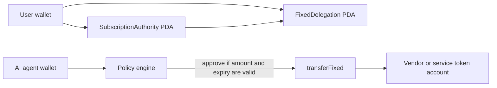

# AgentSpend Guard

AgentSpend Guard is a technical demo for the Superteam Earn bounty:
**"Technical Demo: Solana Native Subscriptions & Allowances Code Sample"**.

The demo shows a practical AI-agent use case for Solana native subscriptions
and allowances: a user grants an AI agent a fixed token allowance with an
expiry, and the agent can pull funds only when both the local policy engine and
the on-chain fixed delegation allow it.

## Why this matters

AI agents need operating budgets for API credits, cloud jobs, paid data, model
calls, and user-authorized workflow payments. Giving an agent an unrestricted
wallet is unsafe. A Solana fixed delegation gives the user a smaller trust
surface:

- the user keeps custody of the underlying token account;
- the agent receives a bounded allowance;
- the allowance can expire;
- transfers can be monitored and reasoned about before the agent spends.

This is useful for agent marketplaces, usage-based SaaS, managed automations,
community bots, and AI tools that need small, auditable operating budgets.

## Architecture



The dry-run script demonstrates three layers:

1. PDA derivation using `@solana/subscriptions`.
2. Local policy evaluation that mirrors the business rules for fixed allowance
   spending.
3. The SDK call plan for live integration:
   `initSubscriptionAuthority`, `createFixedDelegation`, and `transferFixed`.

## Run the demo

```bash
npm install
npm run check
```

`npm run check` runs TypeScript type checking, unit tests, and the dry-run demo.
The demo prints a JSON summary with the derived PDA addresses, spend decisions,
and the live SDK call plan.

For a clean clone or CI environment, use:

```bash
npm ci
npm run check
```

You can override the illustrative addresses and allowance values:

```bash
cp .env.example .env
DELEGATOR_ADDRESS=<user wallet> \
AGENT_ADDRESS=<agent wallet> \
RECEIVER_ADDRESS=<vendor wallet or ATA owner> \
TOKEN_MINT=<mint address> \
npm run demo
```

The default addresses are valid public-key-shaped values for deterministic
dry-run output. They are not meant to represent real wallet ownership.

## Live integration path

To turn the dry-run into a live devnet demo:

1. Create or reuse a token mint supported by the subscriptions program.
2. Create the delegator token account and receiver token account.
3. Build a Solana Kit client with a signer, RPC plugin, and the
   `subscriptionsProgram()` plugin from `@solana/subscriptions`.
4. Call `initSubscriptionAuthority` once for the user token account and mint.
5. Call `createFixedDelegation` with the agent wallet as `delegatee`, a nonce,
   an amount, and an expiry timestamp.
6. Run the policy engine before every agent spend request.
7. If approved, call `transferFixed` for the approved amount and record the
   transaction signature in the README or demo video.

The SDK call shapes are generated by `src/sdk-call-plan.ts` so reviewers can see
exactly where each dry-run concept maps onto the official SDK.

## Example output

The first request spends 2.5 tokens from a 10-token allowance. The second
request tries to spend 8 tokens after 2.5 tokens are already spent, so it is
rejected. The third request happens after expiry and is also rejected.

```text
finalSpent: 2.5 tokens
finalRemaining: 7.5 tokens
approved: agent-indexer-credits
rejected: oversized-model-upgrade
rejected: late-retry
```

## Files

- `src/policy.ts` - local allowance policy and budget accounting.
- `src/solana.ts` - official PDA derivation helpers from `@solana/subscriptions`.
- `src/sdk-call-plan.ts` - the live SDK call plan for review and extension.
- `src/demo.ts` - runnable dry-run demonstration.
- `test/policy.test.ts` - policy tests.
- `SUBMISSION.md` - bounty submission checklist and suggested public writeup.

## Sources

- Solana announcement: https://solana.com/news/subscriptions-and-allowances
- Subscriptions program repo: https://github.com/solana-program/subscriptions
- SDK package: https://www.npmjs.com/package/@solana/subscriptions
- Solana payments docs: https://solana.com/docs/payments/subscriptions/subscription-plan

## License

MIT
